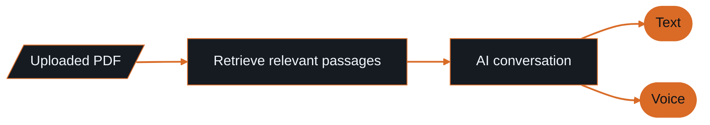

<!--
  Mohammad Bilal · GitHub profile · single-file README (no local assets needed)
  Accent: burnt orange #D96B27 on GitHub dark #0D1117 / #161B22
  Images come from hosted generators: capsule-render, shields.io, skillicons.dev, github-stats.
-->

<a id="top"></a>

<p align="center">
  
</p>

<p align="center">
  <a href="#selected-work"><b>Work</b></a> &nbsp;·&nbsp;
  <a href="#toolkit"><b>Toolkit</b></a> &nbsp;·&nbsp;
  <a href="#experience--education"><b>Experience</b></a> &nbsp;·&nbsp;
  <a href="#github-activity"><b>Activity</b></a> &nbsp;·&nbsp;
  <a href="#connect"><b>Contact</b></a>
</p>

<p align="center">
  
  
  
  
</p>

<p align="center">
  <a href="https://portfolio-beta-gilt-1emaymvhv5.vercel.app/"></a>
  <a href="https://www.linkedin.com/in/mohammad-bilal-64489827b/"></a>
  <a href="mailto:bilalnadeema302003@gmail.com"></a>
  <a href="https://github.com/Bixal99?tab=repositories"></a>
</p>

<br/>

<p align="center">
  I build <b>AI products with a complete software experience</b>:<br/>
  document assistants you can talk to, computer vision tools for accessible communication,<br/>
  and predictive dashboards that turn data into decisions.
</p>

```text
~/bixal99 $ rag.ask("summarise chapter 3")
~/bixal99 $ blink.decode()            # · – · ·
~/bixal99 $ churn.predict(customer)
→ risk 0.82 · retention plan ready
```

<p align="center"></p>

<a id="selected-work"></a>

## ◆ Selected work

<table>
<tr>
<td width="33%" valign="top">
<b>📚 AI Book Assistant</b><br/>
<sub>RAG · VOICE</sub>
<br/><br/>
Upload PDFs and talk to your books by <b>text or voice</b>. A RAG-based reading assistant with a full-stack interface.
<br/><br/>


<br/><br/>
<a href="https://github.com/Bixal99/AIBookAssistant"><b>Repository →</b></a><br/>
<a href="https://ai-book-assistant-blush.vercel.app/"><b>Live assistant →</b></a>
</td>
<td width="33%" valign="top">
<b>👁️ Eye Blink Morse Detector</b><br/>
<sub>COMPUTER VISION · ACCESSIBILITY</sub>
<br/><br/>
A <b>hands-free communication tool</b> that turns intentional webcam-detected blinks into Morse code and text using facial landmarks and blink timing.
<br/><br/>


<br/><br/>
<a href="https://github.com/Bixal99/EyeBlinkMorseDetector"><b>Repository →</b></a><br/>
<a href="https://eye-blink-morse-detector-4l3hrfxqo-bixal99s-projects.vercel.app/"><b>Live demo →</b></a>
</td>
<td width="33%" valign="top">
<b>📉 Customer Churn Prediction</b><br/>
<sub>MACHINE LEARNING · GENAI</sub>
<br/><br/>
An end-to-end telecom churn app combining <b>XGBoost predictions</b>, an interactive risk dashboard, and <b>Gemini-generated retention insights</b>.
<br/><br/>


<br/><br/>
<a href="https://github.com/Bixal99/Churn-Prediction"><b>Repository →</b></a><br/>
<a href="https://churn-prediction-k3yjzaxx2mgel668arspbc.streamlit.app/"><b>Live dashboard →</b></a>
</td>
</tr>
</table>

<details>
<summary><b>See how the three flagship projects work</b></summary>

<br/>

**AI Book Assistant · document to conversation**



**Eye Blink Morse Detector · from blink to message**


**Customer Churn Prediction · predictive plus generative**


</details>

### More builds

| | |
| :--- | :--- |
| 📄 **[ResuMate](https://github.com/Bixal99/Resume-Builder)**<br/>ATS-ready resume builder with neural parsing and AI bullet enhancement. | 🎓 **[Study Platform / Interview Help](https://github.com/Bixal99/Interview-Help)** · [Demo](https://interview-help-eight.vercel.app/)<br/>Student learning platform and software infrastructure. |
| 🖼️ **[Pentagram Image Diffusion](https://github.com/Bixal99/Pentagram-Image-Diffusion)**<br/>Text-to-image generation from natural language prompts. | 🦅 **[Falcon](https://github.com/Bixal99/FALCON)**<br/>Wholesale books, inventory, customer accounts, and reporting for Doha shops. |

<details>
<summary><b>Explore the full project collection</b></summary>

<br/>

| Project | Repository | Live demo |
| :--- | :--- | :--- |
| Portfolio | [Source](https://github.com/Bixal99/Portfolio) | [Website](https://portfolio-beta-gilt-1emaymvhv5.vercel.app/) |
| RetroVerse | [Source](https://github.com/Bixal99/RetroVerse) | [Demo](https://retroverse-opal.vercel.app/) |
| Ghoomora | [Source](https://github.com/Bixal99/Ghoomora) | [Demo](https://ghoomora.vercel.app/) |
| Scrapper | [Source](https://github.com/Bixal99/Scrapper) | [Demo](https://helpscript.vercel.app/) |
| School Management System | [Source](https://github.com/Bixal99/School-Management-System) | – |
| HMS | [Source](https://github.com/Bixal99/HMS) | – |
| ODOO Guide | [Source](https://github.com/Bixal99/ODOO) | – |
| DailyLeet | [Source](https://github.com/Bixal99/DailyLeet) | – |

</details>

<p align="center"></p>

<a id="toolkit"></a>

## ◆ Toolkit

<p align="center"><b>Languages · frameworks · platforms</b></p>

<p align="center">
  
</p>

<p align="center"><b>AI & vision</b></p>

<p align="center">
  
  
  
  
  
  
  
  
  
  
  
  
</p>

<p align="center"><b>Interfaces, data & tooling</b></p>

<p align="center">
  
  
  
  
  
  
  
  
  
  
  
  
</p>

<details>
<summary><b>Foundations and applied expertise</b></summary>

<br/>

**Foundations:** SQL · C · C++ · HTML5 · CSS3 · Algorithms · OOP · Networks · Software development lifecycle

| Area | What I do |
| :--- | :--- |
| 👁️ **Computer vision** | Facial landmarks, eye-blink detection, accessible interfaces |
| 📊 **Machine learning** | Classification, regression, feature pipelines, model evaluation |
| 🤖 **Generative AI** | Retrieval, orchestration, prompting, conversational applications |
| 📄 **Document intelligence** | PDF extraction, OCR, scraping pipelines |
| 📈 **Analytics** | Interactive dashboards and visual data exploration |

</details>

<p align="center"></p>

<a id="experience--education"></a>

## ◆ Experience & education

| 💼 **Experience** | 🎓 **Education** |
| :--- | :--- |
| **AI Engineer · Zennore**<br/>Pakistan · June 2025 – Present<br/><br/>Deliver AI-powered product features through cross-functional collaboration, prompt engineering, and production workflows, from concept through release. | **BS Computer Science · FAST NUCES**<br/>Pakistan · August 2022 – June 2026<br/><br/>Portfolio across AI, computer vision, full-stack development, and systems engineering, backed by 1+ year of professional AI engineering experience. |

**Deloitte WorldClass certificates** &nbsp;·&nbsp; Critical Thinking (Sep 8, 2026) &nbsp;·&nbsp; Effective Leadership (Sep 10, 2026)

<details>
<summary><b>Further learning, coding profiles, and languages</b></summary>

<br/>

**In progress:** AWS · Oracle · NPTEL · Cisco

**Coding profiles:** [LeetCode](https://leetcode.com/Bixal99) · [GeeksforGeeks](https://geeksforgeeks.org/user/Bixal99) · [HackerRank](https://hackerrank.com/Bixal99) · [CodeChef](https://codechef.com/users/Bixal99)

**Languages:** English (fluent) · Urdu (fluent) · Hindi (intermediate) · Arabic (beginner)

</details>

### Currently exploring

`LangGraph orchestration` &nbsp; `Vector databases` &nbsp; `RAG with pgvector + Neon` &nbsp; `AI infrastructure` &nbsp; `LLM quality monitoring` &nbsp; `Full-stack SaaS` &nbsp; `CI/CD for AI systems` &nbsp; `Computer vision for accessibility`

<p align="center"></p>

<a id="github-activity"></a>

## ◆ GitHub activity

<p align="center">
  <a href="https://github.com/Bixal99"></a>
  &nbsp;
  <a href="https://github.com/Bixal99"></a>
</p>

<p align="center">
  <a href="https://github.com/Bixal99"></a>
</p>

<p align="center">
  <a href="https://github.com/Bixal99"></a>
</p>

<details>
<summary><b>Activity by hour · Qatar time (UTC+3)</b></summary>

<p align="center">
  <a href="https://github.com/Bixal99"></a>
</p>

</details>

<p align="center"><sub>Live public GitHub data · each provider caches independently</sub></p>

### Achievements

<p align="center">
  <a href="https://github.com/Bixal99?achievement=pull-shark&amp;tab=achievements"></a>
  &nbsp;&nbsp;&nbsp;&nbsp;
  <a href="https://github.com/Bixal99?achievement=yolo&amp;tab=achievements"></a>
  &nbsp;&nbsp;&nbsp;&nbsp;
  <a href="https://github.com/Bixal99?achievement=quickdraw&amp;tab=achievements"></a>
</p>

<p align="center"><b>Pull Shark &nbsp;·&nbsp; YOLO &nbsp;·&nbsp; Quickdraw</b></p>

<br/>

<a id="connect"></a>

<p align="center">
  <a href="mailto:bilalnadeema302003@gmail.com"></a>
</p>

<p align="center">
  <a href="mailto:bilalnadeema302003@gmail.com">Email</a> &nbsp;/&nbsp;
  <a href="https://www.linkedin.com/in/mohammad-bilal-64489827b/">LinkedIn</a> &nbsp;/&nbsp;
  <a href="https://portfolio-beta-gilt-1emaymvhv5.vercel.app/">Portfolio</a> &nbsp;/&nbsp;
  <a href="https://github.com/Bixal99">GitHub</a>
  <br/>
  <sub>Open to AI/ML roles, full-stack collaboration, freelance work, and contracts · <a href="#top">Back to top ↑</a></sub>
</p>
