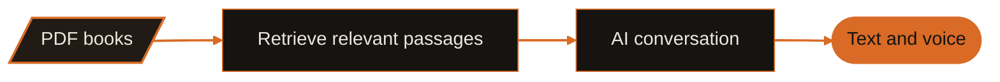
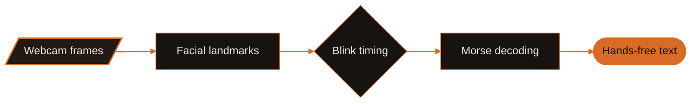
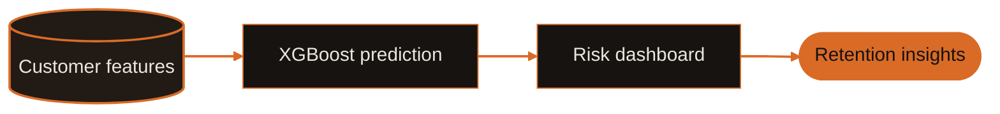

<!-- =========================================================
  Mohammad Bilal - Profile README
  Theme: Cyan (#0891B2) + Violet (#7C3AED) only | Poppins | Live data
  ========================================================= -->

  <!-- HEADER: 2-color cyan -> violet wave -->
  

   

  

    

  <!-- Interactive quick nav -->
  
  
  
  

    

  
  
  
  

    

  
  
  

    

  
  
  

 

  

<!-- MIDDLE: burnt orange #D96B27, charcoal #161310, warm white #ECE6DF. -->
<!-- Header and footer are preserved exactly from the supplied template. -->

  

<h2 align="center">AI engineer. Software builder. Problem solver.</h2>

  I'm <b>Mohammad Bilal</b>, an AI/ML and Software Engineer based in <b>Doha, Qatar</b>. 
  A Computer Science graduate from <b>FAST NUCES</b>, building across 
  generative AI, computer vision, and full-stack product development.

  
  
  
  

<table width="100%">
  <tr>
    <td width="33%" align="center" valign="top">
      <h3>Understand documents</h3>
      
Make PDFs searchable, conversational, and easier to work with.

      RAG · OCR · LLM orchestration
    </td>
    <td width="33%" align="center" valign="top">
      <h3>Read real-world signals</h3>
      
Turn visual input and customer data into useful outputs.

      Computer vision · Predictive models
    </td>
    <td width="33%" align="center" valign="top">
      <h3>Build the complete product</h3>
      
Connect the model, API, database, and interface.

      Next.js · FastAPI · PostgreSQL
    </td>
  </tr>
</table>

Open to AI/ML roles, full-stack collaboration, freelance work, and contracts.

---

## GitHub, in motion

Live statistics · Contribution streaks · Annual activity · Hourly patterns

<!-- Real SVG responses verified on 2026-10-04. Hosted charts use one burnt-orange accent. -->
<!-- Providers: https://github.com/stats-organization/github-stats-extended -->
<!-- https://github.com/DenverCoder1/github-readme-streak-stats -->
<!-- https://github.com/vn7n24fzkq/github-profile-summary-cards -->

  
  

### A year of contribution activity

  

### When contributions happen

  

### The classic green calendar

<!-- Preserve the original, flat green calendar. No 3D map or recolored calendar. -->

  

Public GitHub activity; chart providers may cache updates.

---

## Inside the projects

Three ways I turn AI into practical software. The diagrams show the main flow of each project.

### AI Book Assistant

**From a PDF to a conversation.** Upload books and explore them through text and voice with a RAG-based reading assistant.

  
  
  
  

[View repository](https://github.com/Bixal99/AIBookAssistant) · [Try the assistant](https://ai-book-assistant-blush.vercel.app/)

### Eye Blink Morse Detector

**From a blink to a message.** An accessibility-focused typing system that turns intentional eye blinks into Morse code and text.

  
  
  
  

[View repository](https://github.com/Bixal99/EyeBlinkMorseDetector) · [Explore the demo](https://eye-blink-morse-detector-4l3hrfxqo-bixal99s-projects.vercel.app/)

### AI Customer Churn Prediction

**From customer data to retention insights.** An end-to-end telecom churn application combining XGBoost predictions, a Streamlit dashboard, and Gemini-generated recommendations.

  
  
  
  

[View repository](https://github.com/Bixal99/Churn-Prediction) · [Open the dashboard](https://churn-prediction-k3yjzaxx2mgel668arspbc.streamlit.app/)

### More from the workbench

<table width="100%">
  <tr>
    <td width="50%" valign="top">
      <h3>ResuMate</h3>
      
An ATS-ready resume builder with neural parsing and generative AI bullet enhancement.

      JavaScript · Generative AI · Document workflows
      
<a href="https://github.com/Bixal99/Resume-Builder">View repository →</a>

    </td>
    <td width="50%" valign="top">
      <h3>Study Platform / Interview Help</h3>
      
A student learning platform, with infrastructure work focused on scalability and reliability.

      Python · JavaScript · C++ · CRUD
      
<a href="https://github.com/Bixal99/Interview-Help">View repository →</a> · <a href="https://interview-help-eight.vercel.app/">Demo</a>

    </td>
  </tr>
  <tr>
    <td width="50%" valign="top">
      <h3>Pentagram Image Diffusion</h3>
      
Text-to-image generation guided by natural language prompts.

      TypeScript · Image diffusion
      
<a href="https://github.com/Bixal99/Pentagram-Image-Diffusion">View repository →</a>

    </td>
    <td width="50%" valign="top">
      <h3>Falcon</h3>
      
Wholesale business books, stock, customer accounts, and reporting for Doha shops.

      Next.js · TypeScript · Supabase · PostgreSQL
      
<a href="https://github.com/Bixal99/FALCON">View repository →</a>

    </td>
  </tr>
</table>

<b>Browse the rest of the portfolio</b>

 

| Project | Repository | Live demo |
| :--- | :--- | :--- |
| Portfolio | [Source](https://github.com/Bixal99/Portfolio) | [Website](https://portfolio-beta-gilt-1emaymvhv5.vercel.app/) |
| RetroVerse | [Source](https://github.com/Bixal99/RetroVerse) | [Demo](https://retroverse-opal.vercel.app/) |
| Ghoomora | [Source](https://github.com/Bixal99/Ghoomora) | [Demo](https://ghoomora.vercel.app/) |
| Scrapper | [Source](https://github.com/Bixal99/Scrapper) | [Demo](https://helpscript.vercel.app/) |
| School Management System | [Source](https://github.com/Bixal99/School-Management-System) | — |
| HMS | [Source](https://github.com/Bixal99/HMS) | — |
| ODOO Guide | [Source](https://github.com/Bixal99/ODOO) | — |
| DailyLeet | [Source](https://github.com/Bixal99/DailyLeet) | — |

---

## The toolkit

  
  
  
  
  
  

| Build layer | Technologies |
| :--- | :--- |
| **Languages** | Python, JavaScript, TypeScript, SQL, C, C++, HTML5, CSS3 |
| **Interfaces** | Next.js, React, Tailwind CSS, GSAP, Framer Motion, Zustand |
| **APIs and services** | Node.js, Express, FastAPI, Flask, Pydantic, Better Auth |
| **AI and orchestration** | LangChain, LangGraph, RAG, Ollama, Groq, OpenAI, Anthropic, Gemini |
| **Vision and documents** | OpenCV, MediaPipe, OCR, PyMuPDF, Selenium, Beautiful Soup |
| **Data and ML** | XGBoost, Pandas, NumPy, Streamlit, Plotly |
| **Storage** | PostgreSQL, MongoDB, Supabase |
| **Delivery** | Git, Docker, Linux, Vercel, GitLab CI/CD, Postman, Figma, Hugging Face |

<b>Applied expertise</b>

 

| Domain | Focus |
| :--- | :--- |
| Computer Vision | Real-time facial landmarks, eye-blink detection, accessible interfaces |
| Machine Learning | Classification, regression, feature pipelines, model evaluation |
| Generative AI | RAG, LLM orchestration, prompting, conversational applications |
| Document Intelligence | PDF extraction, OCR, scraping pipelines |
| Data Analytics | Interactive Streamlit dashboards and Plotly visualizations |

---

## Experience and education

<table width="100%">
  <tr>
    <td width="50%" valign="top">
      
      <h3>AI Engineer · Zennore</h3>
      
Pakistan · June 2025–Present

      
Deliver AI-powered product features through cross-functional collaboration, prompt engineering, and production workflows.

      AI engineering · Product delivery · Startup collaboration
    </td>
    <td width="50%" valign="top">
      
      <h3>BS Computer Science · FAST NUCES</h3>
      
Pakistan · August 2022–June 2026

      
Computer Science graduate with hands-on projects across AI, computer vision, and full-stack software.

      Algorithms · OOP · Networks · Software development
    </td>
  </tr>
</table>

---

## Recognition and achievements

<b>Three earned GitHub achievements.</b> Verified against the public profile and achievements tab.

<!-- Earned badges verified at https://github.com/Bixal99?tab=achievements on 2026-10-04. -->
<!-- Official badge artwork retains GitHub's original colors. -->
<table width="100%">
  <tr>
    <td width="33%" align="center">
      
      <h3>Pull Shark</h3>
      GitHub achievement
    </td>
    <td width="33%" align="center">
      
      <h3>YOLO</h3>
      GitHub achievement
    </td>
    <td width="33%" align="center">
      
      <h3>Quickdraw</h3>
      GitHub achievement
    </td>
  </tr>
</table>

<a href="https://github.com/Bixal99?tab=achievements">View achievements on GitHub →</a>

| Recognition | Details |
| :--- | :--- |
| **BS Computer Science** | FAST NUCES, 2022–2026 |
| **AI Engineer** | 1+ year of professional experience |
| **Multi-domain portfolio** | AI, computer vision, full-stack, and systems engineering |

---

## Learning beyond the code

<table width="100%">
  <tr>
    <td width="50%" valign="top">
      
      
<b>Deloitte WorldClass</b> Completed September 8, 2026

    </td>
    <td width="50%" valign="top">
      
      
<b>Deloitte WorldClass</b> Completed September 10, 2026

    </td>
  </tr>
</table>

<b>Certifications in progress and coding profiles</b>

 

**In progress:** AWS · Oracle · NPTEL · Cisco

**Coding:** [LeetCode](https://leetcode.com/Bixal99) · [GeeksforGeeks](https://geeksforgeeks.org/user/Bixal99) · [HackerRank](https://hackerrank.com/Bixal99) · [CodeChef](https://codechef.com/users/Bixal99)

**Languages:** English (fluent) · Urdu (fluent) · Hindi (intermediate) · Arabic (beginner)

---

## What I'm working toward

| Direction | Current focus |
| :--- | :--- |
| **Learning** | LangGraph orchestration, vector databases, and RAG with pgvector and Neon |
| **Building** | AI infrastructure, LLM quality monitoring, and full-stack SaaS products |
| **Exploring** | CI/CD for AI systems and computer vision for accessibility |
| **Open to** | AI/ML roles, full-stack collaboration, freelance work, and contracts |

  

  <a href="#featured-work">Explore projects</a> · <a href="#live-analytics">View analytics</a> · <a href="#connect">Get in touch</a>

---

<!-- CONNECT + FOOTER -->

  
    

  
  
  
  

    

  

    

  <!-- FOOTER: same 2-color cyan -> violet wave -->
  

