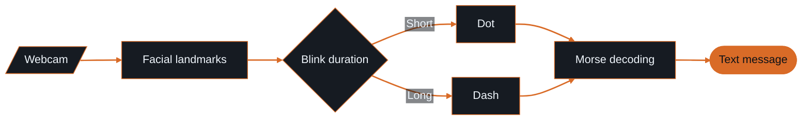
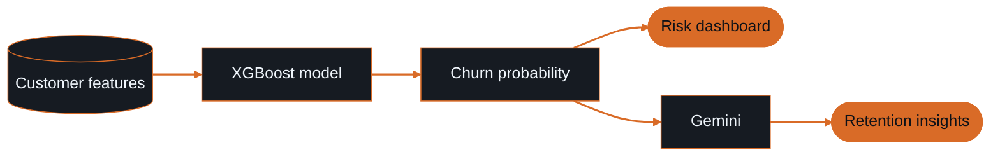

<!--
  Mohammad Bilal · GitHub portfolio
  Burnt orange #D96B27 · GitHub dark #0D1117 / #161B22
  Upload profile-assets/ beside this file. No custom CSS or animated headings.
-->

  

  <a href="#featured-work">Selected work</a> &nbsp; / &nbsp;
  <a href="#live-analytics">GitHub activity</a> &nbsp; / &nbsp;
  <a href="#stack">Toolkit</a> &nbsp; / &nbsp;
  <a href="#achievements">Achievements</a> &nbsp; / &nbsp;
  <a href="#connect">Contact</a>

I build **AI products with a complete software experience**: document assistants you can talk to, computer vision tools for accessible communication, and predictive dashboards that turn data into decisions.

I'm **Mohammad Bilal**, an **AI/ML and Software Engineer** based in **Doha, Qatar**, and a **Computer Science graduate from FAST NUCES**. My work connects models, APIs, databases, and interfaces.

[Portfolio](https://portfolio-beta-gilt-1emaymvhv5.vercel.app/) · [LinkedIn](https://www.linkedin.com/in/mohammad-bilal-64489827b/) · [Email](mailto:bilalnadeema302003@gmail.com)

---

## Selected work

  

### AI Book Assistant

Upload PDFs and explore your books through **text and voice conversations**. A RAG-based reading assistant built around a full-stack interface.

**Built with:** Next.js · TypeScript · Vapi AI · Tailwind CSS

[Repository →](https://github.com/Bixal99/AIBookAssistant) &nbsp; [Live assistant →](https://ai-book-assistant-blush.vercel.app/)

<b>See the document-to-conversation flow</b>

### Eye Blink Morse Detector

A **hands-free communication tool** that translates intentional webcam-detected blinks into Morse code and text using facial landmarks and blink timing.

**Built with:** Python · OpenCV · MediaPipe Face Mesh · NumPy

[Repository →](https://github.com/Bixal99/EyeBlinkMorseDetector) &nbsp; [Live demo →](https://eye-blink-morse-detector-4l3hrfxqo-bixal99s-projects.vercel.app/)

<b>See how a blink becomes a message</b>

### AI Customer Churn Prediction

An end-to-end telecom churn application combining **XGBoost predictions**, an interactive risk dashboard, and **Gemini-generated retention insights**.

**Built with:** Python · Streamlit · XGBoost · Plotly · Pandas · Gemini

[Repository →](https://github.com/Bixal99/Churn-Prediction) &nbsp; [Live dashboard →](https://churn-prediction-k3yjzaxx2mgel668arspbc.streamlit.app/)

<b>See the predictive and generative workflow</b>

### Other builds

- **[ResuMate](https://github.com/Bixal99/Resume-Builder)** · ATS-ready resume builder with neural parsing and AI bullet enhancement.
- **[Study Platform / Interview Help](https://github.com/Bixal99/Interview-Help)** · Student learning platform and software infrastructure. [Demo →](https://interview-help-eight.vercel.app/)
- **[Pentagram Image Diffusion](https://github.com/Bixal99/Pentagram-Image-Diffusion)** · Text-to-image generation from natural language prompts.
- **[Falcon](https://github.com/Bixal99/FALCON)** · Wholesale business books, inventory, customer accounts, and reporting for Doha shops.

<b>Explore the full project collection</b>

| Project | Repository | Live demo |
| :--- | :--- | :--- |
| Portfolio | [Source](https://github.com/Bixal99/Portfolio) | [Website](https://portfolio-beta-gilt-1emaymvhv5.vercel.app/) |
| RetroVerse | [Source](https://github.com/Bixal99/RetroVerse) | [Demo](https://retroverse-opal.vercel.app/) |
| Ghoomora | [Source](https://github.com/Bixal99/Ghoomora) | [Demo](https://ghoomora.vercel.app/) |
| Scrapper | [Source](https://github.com/Bixal99/Scrapper) | [Demo](https://helpscript.vercel.app/) |
| School Management System | [Source](https://github.com/Bixal99/School-Management-System) | - |
| HMS | [Source](https://github.com/Bixal99/HMS) | - |
| ODOO Guide | [Source](https://github.com/Bixal99/ODOO) | - |
| DailyLeet | [Source](https://github.com/Bixal99/DailyLeet) | - |

---

## GitHub achievements

<!-- All three earned achievements verified at https://github.com/Bixal99?tab=achievements. -->

  
  &nbsp;&nbsp;&nbsp;&nbsp;
  
  &nbsp;&nbsp;&nbsp;&nbsp;
  

<b>Pull Shark &nbsp; · &nbsp; YOLO &nbsp; · &nbsp; Quickdraw</b> <a href="https://github.com/Bixal99?tab=achievements">View on GitHub ·</a>

---

## GitHub activity

<!-- Stats and streak are both 495 · 195 SVGs: identical width and aspect ratio. -->

  
  &nbsp;
  

#### Contribution trends

  

#### Contribution calendar

<!-- Native green palette; solid dark canvas and dark empty cells. -->
<!-- Service documentation: https://gh-heat.anishroy.com/ -->

  

<b>View activity by hour · Qatar time, UTC+3</b>

  

Live public GitHub data. Providers cache updates independently.

---

## Toolkit

**AI and vision**  
LangChain · LangGraph · RAG · OpenCV · MediaPipe · OCR · XGBoost · OpenAI · Anthropic · Gemini · Ollama · Groq

**Product engineering**  
Python · JavaScript · TypeScript · Next.js · React · FastAPI · Flask · Node.js · Express · Pydantic · Better Auth

**Interfaces and data**  
Tailwind CSS · GSAP · Framer Motion · Zustand · Streamlit · Plotly · Pandas · NumPy · PostgreSQL · MongoDB · Supabase

**Delivery and tooling**  
Git · Docker · Linux · Vercel · GitLab CI/CD · Postman · Figma · Hugging Face · PyMuPDF · Selenium · Beautiful Soup

<b>Foundations and applied expertise</b>

**Foundations:** SQL · C · C++ · HTML5 · CSS3 · Algorithms · OOP · Networks · Software development lifecycle

- **Computer vision:** Facial landmarks, eye-blink detection, and accessible interfaces.
- **Machine learning:** Classification, regression, feature pipelines, and model evaluation.
- **Generative AI:** Retrieval, orchestration, prompting, and conversational applications.
- **Document intelligence:** PDF extraction, OCR, and scraping pipelines.
- **Analytics:** Interactive dashboards and visual data exploration.

---

## Experience, education, and recognition

**AI Engineer · Zennore**  
Pakistan · June 2025–Present

Deliver AI-powered product features through cross-functional collaboration, prompt engineering, and production workflows. Contribute from concept through release.

**BS Computer Science · FAST NUCES University**  
Pakistan · August 2022–June 2026

Computer Science graduate with a portfolio across AI, computer vision, full-stack development, and systems engineering, and 1+ year of professional AI engineering experience.

**Deloitte WorldClass certificates**

- **Critical Thinking** · completed September 8, 2026.
- **Effective Leadership** · completed September 10, 2026.

<b>Further learning, coding profiles, and languages</b>

**Certifications in progress:** AWS · Oracle · NPTEL · Cisco

**Coding profiles:** [LeetCode](https://leetcode.com/Bixal99) · [GeeksforGeeks](https://geeksforgeeks.org/user/Bixal99) · [HackerRank](https://hackerrank.com/Bixal99) · [CodeChef](https://codechef.com/users/Bixal99)

**Languages:** English (fluent) · Urdu (fluent) · Hindi (intermediate) · Arabic (beginner)

## Currently exploring

LangGraph orchestration, vector databases, and RAG with pgvector and Neon. Building AI infrastructure, LLM quality monitoring, and full-stack SaaS products; exploring CI/CD for AI systems and computer vision for accessibility.

---

  

  <a href="mailto:bilalnadeema302003@gmail.com">Email</a> &nbsp; / &nbsp;
  <a href="https://www.linkedin.com/in/mohammad-bilal-64489827b/">LinkedIn</a> &nbsp; / &nbsp;
  <a href="https://portfolio-beta-gilt-1emaymvhv5.vercel.app/">Portfolio</a> &nbsp; / &nbsp;
  <a href="https://github.com/Bixal99">GitHub</a>

Open to AI/ML roles, full-stack collaboration, freelance work, and contracts.

